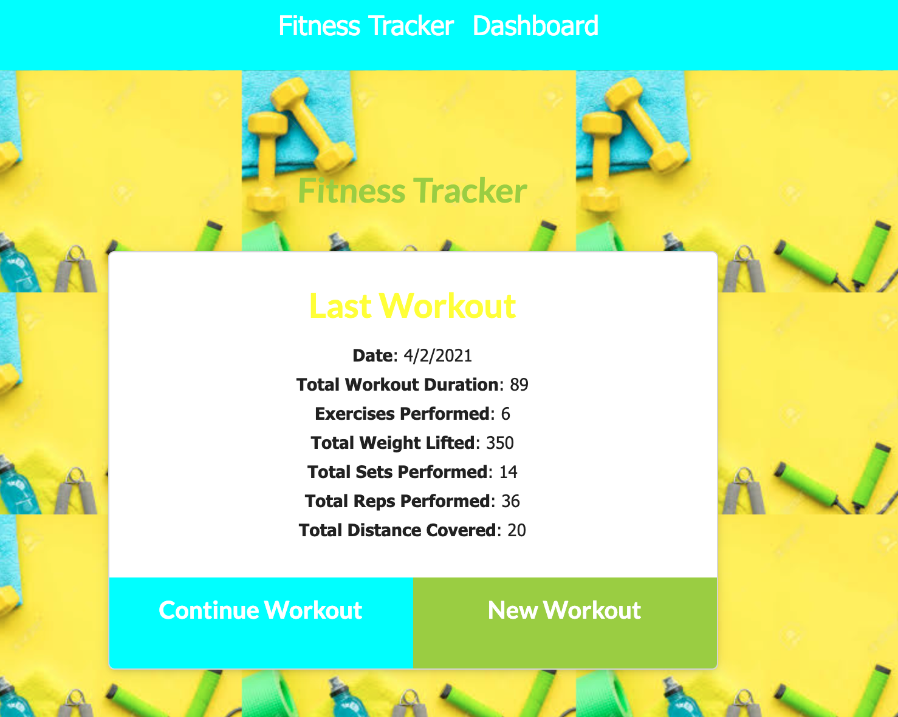
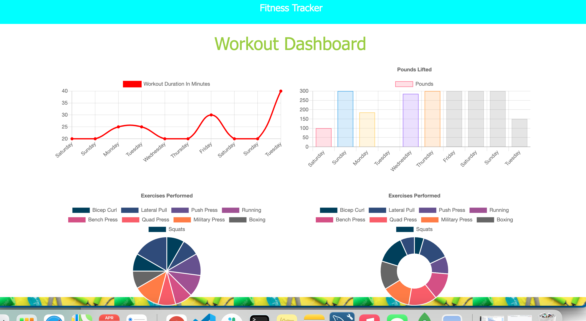

# Fitness Tracker
    

---
## Description
For this assignment, you'll create a workout tracker. This assignment will require you to create Mongo database with a Mongoose schema and handle routes with Express.
    
## Table of Contents 
     
---
* [Installation](#Installation)
* [UserStory](#UserStory)
* [Usage](#Usage)
* [Credits](#Credits)
* [License](#License)
* [Badges](#Badges)
* [Questions](#Questions|Comments|Concerns)
    
---
## Installation

npm mongoose , npm morgan , npm express

---

## UserStory

As a user, I want to be able to view create and track daily workouts. I want to be able to log multiple exercises in a workout on a given day. I should also be able to track the name, type, weight, sets, reps, and duration of exercise. If the exercise is a cardio exercise, I should be able to track my distance traveled.

---

## Usage 

A consumer will reach their fitness goals more quickly when they track their workout progress.

---

## Credits 

No collaborators.

---

## License

---

## Badges 

---

## Questions|Comments|Concerns

https://github.com/imanid-code

imanidillahunt@gmail.com
---
